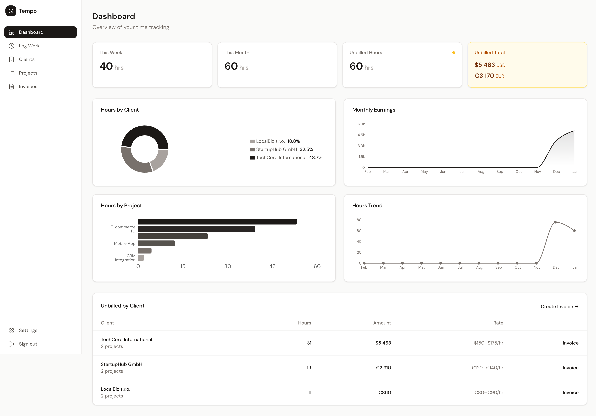
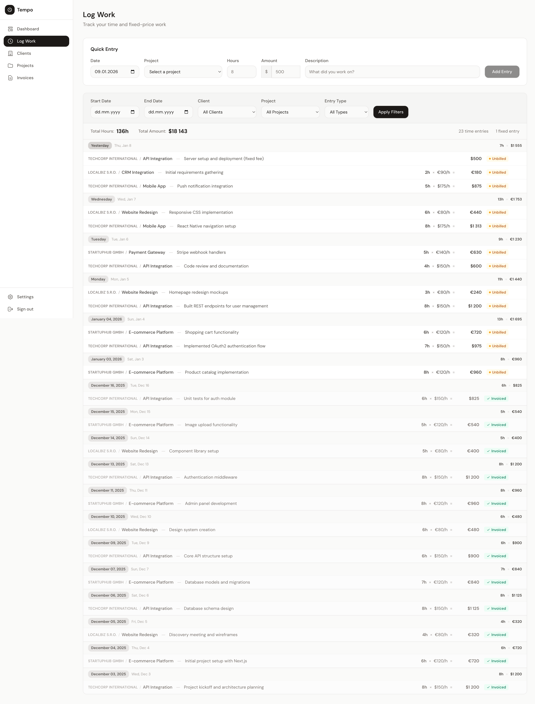
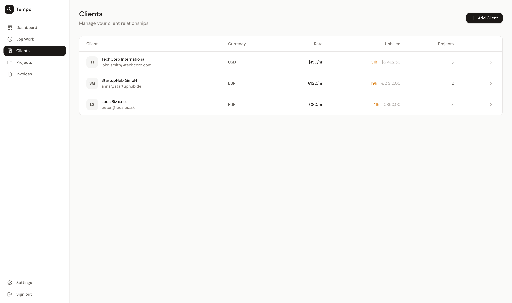
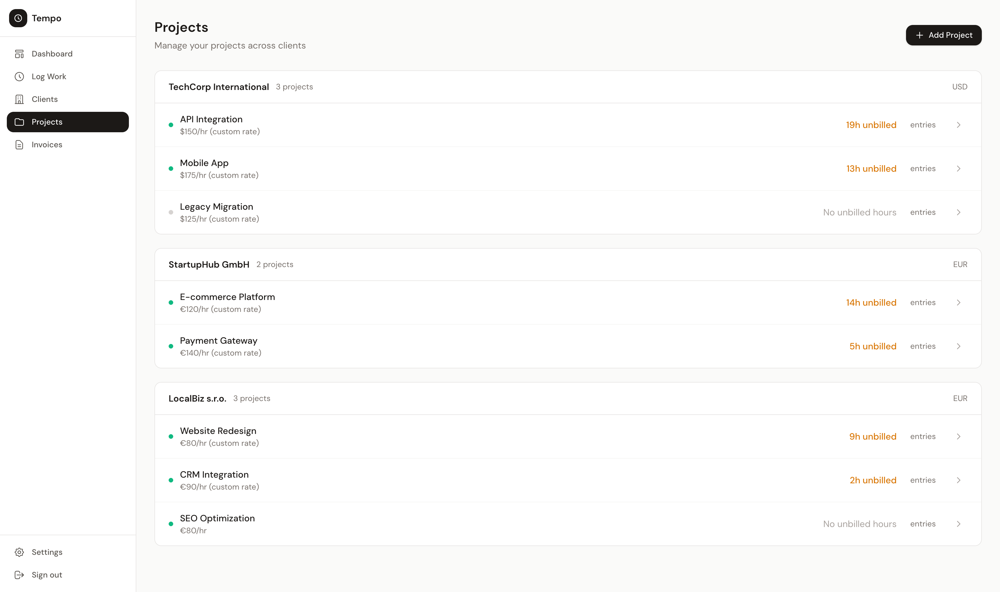
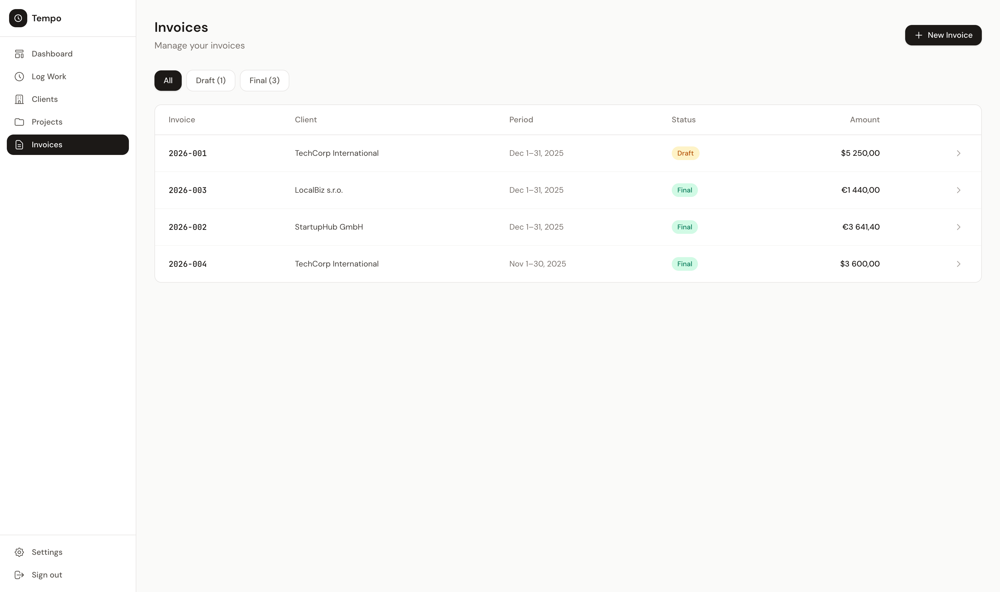
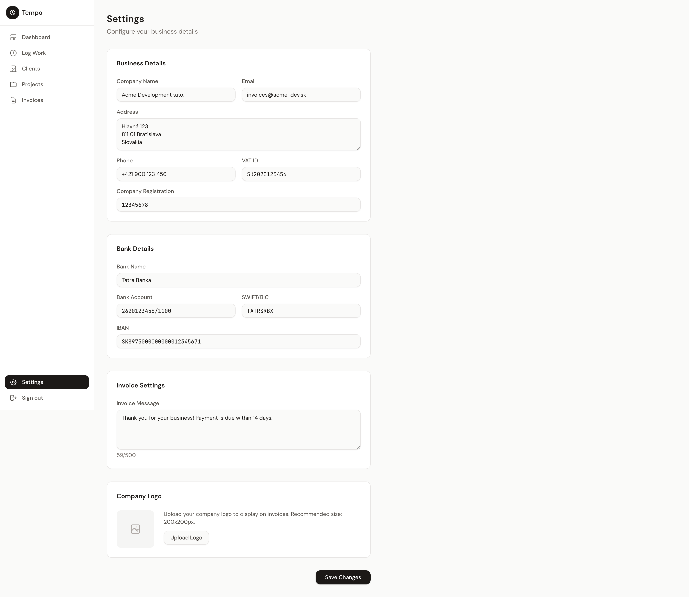
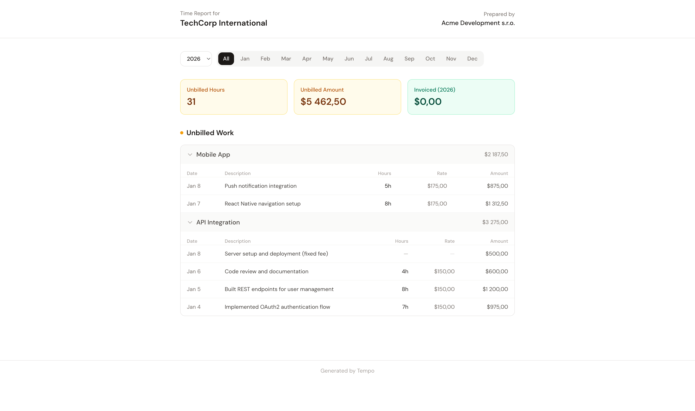

# Invoicing

Personal time tracking and invoicing application for independent developers working with multiple clients.

## Screenshots

### Dashboard


### Log Work


### Clients


### Projects


### Invoices


### Settings


### Customer Report (Shareable)


## Tech Stack

- **Backend:** Rails 8.1 with Ruby 3.3
- **Frontend:** React 19 + TypeScript via Inertia.js
- **UI:** Tailwind CSS + shadcn/ui
- **Database:** SQLite3
- **PDF:** Grover (Puppeteer-based)

## Setup

```bash
bundle install
npm install
bin/rails db:prepare
```

## Development

```bash
bin/dev                    # Start Rails + Vite dev servers
```

Access the app at http://localhost:5100

## Parallel Development

Work on multiple features simultaneously with isolated environments.

### Quick Start

```bash
# Build a new feature with Claude Code
bin/build-feature "feature-name" "Description of what to build"

# Example
bin/build-feature "invoice-reminders" "Add email reminders for unpaid invoices"
```

### Commands

| Command | Description |
|---------|-------------|
| `bin/build-feature <name> <prompt>` | Create worktree and start Claude with /build |
| `bin/worktree-setup <name>` | Create isolated worktree for manual development |
| `bin/dev-feature <name>` | Run dev server with feature-specific ports (same directory) |

### How It Works

Each parallel environment gets:
- **Separate directory:** `../invoicing-<feature-name>`
- **Own git branch:** `feature/<feature-name>`
- **Isolated database:** `storage/development-<feature-name>.sqlite3`
- **Unique ports:** Rails 3001+, Vite 3137+

### Example Workflow

```bash
# Terminal 1 - main development
cd invoicing
bin/dev                     # Rails: 5100, Vite: 3036

# Terminal 2 - feature work
bin/build-feature "auth" "Add user authentication"
# Creates ../invoicing-auth and starts Claude

# Terminal 3 - another feature
bin/build-feature "reports" "Add monthly revenue reports"
# Creates ../invoicing-reports and starts Claude
```

### Managing Worktrees

```bash
# List all worktrees
git worktree list

# Remove a worktree when done
git worktree remove ../invoicing-<feature-name>

# Clean up merged branches
git branch -d feature/<feature-name>
```

## Testing

```bash
# Backend
bundle exec rspec

# Frontend
npm test              # Watch mode
npm run test:run      # Single run
npm run typecheck     # TypeScript check
```

## Build

```bash
npm run build         # Production frontend build
```

## Deployment

This is a **single-user application** designed for personal use. It uses [Kamal](https://kamal-deploy.org/) to deploy Docker containers to your own VPS.

### Prerequisites

- A VPS with SSH access (Ubuntu 22.04+ recommended)
- Docker installed on your local machine
- A container registry (Docker Hub, GitHub Container Registry, or AWS ECR)
- A domain name pointed to your VPS IP address

### Server Setup

SSH into your VPS and install Docker:

```bash
curl -fsSL https://get.docker.com | sh
```

Ensure your user can run Docker without sudo, or use root for deployment.

### Local Configuration

1. **Copy the deploy configuration template:**

   ```bash
   cp config/deploy.yml.example config/deploy.yml
   ```

2. **Create a `.env` file** with your deployment variables:

   ```bash
   DEPLOY_SERVER_IP=your.server.ip.address
   PROXY_HOST=your-domain.com
   ```

3. **Edit `config/deploy.yml`** and configure:

   - `service`: Your application name
   - `image`: Container image name
   - `registry`: Your container registry details
   - Update the `password` command for your registry (e.g., `aws ecr get-login-password` for AWS ECR)

4. **Configure secrets** in `.kamal/secrets`:

   ```bash
   # For AWS ECR
   AWS_ACCESS_KEY_ID=$AWS_ACCESS_KEY_ID
   AWS_SECRET_ACCESS_KEY=$AWS_SECRET_ACCESS_KEY

   # Rails master key (required)
   RAILS_MASTER_KEY=$(cat config/master.key)
   ```

### Deploy

```bash
# First-time setup (provisions server and deploys)
bin/kamal setup

# Subsequent deployments
bin/kamal deploy
```

### Post-Deployment: Change Default Credentials

A default admin user is created during deployment with these credentials:
- **Email:** `admin@example.com`
- **Password:** `password`

**You must change these immediately after deployment:**

```bash
# Connect to Rails console on the server
bin/kamal console

# In the Rails console, update the user:
user = User.first
user.update!(email_address: "your-email@example.com", password: "your-secure-password")
exit
```

### Useful Kamal Commands

```bash
bin/kamal console      # Rails console on server
bin/kamal shell        # Bash shell in container
bin/kamal logs         # Tail application logs
bin/kamal app restart  # Restart the application
```

### SSL/HTTPS

Kamal automatically provisions SSL certificates via Let's Encrypt when `proxy.ssl: true` is set. Ensure your domain's DNS is properly configured before the first deployment.
